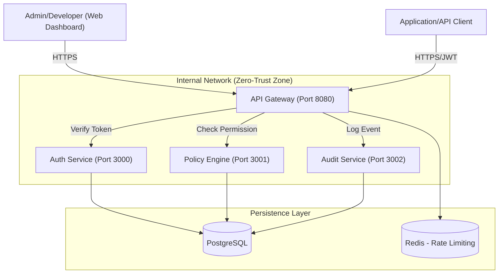

# High-Level Design (HLD) - Zero-Trust Secure API Platform (ZTSAP)

## 1. Overview
The Zero-Trust Secure API Platform (ZTSAP) is an enterprise-grade microservices architecture designed to provide secure, audited, and authorized access to internal and external APIs. It adheres to the core principle: "Never trust, always verify."

## 2. Architecture Diagram

## 3. Core Components

### 3.1 API Gateway (Gateway)
- **Role**: Single entry point and security proxy.
- **Responsibilities**:
    - **Authentication**: Validates JWTs using the Auth Service's public key or secret.
    - **Authorization**: Calls the Policy Engine for every request.
    - **Audit Logging**: Intercepts requests/responses and forwards them to the Audit Service.
    - **Rate Limiting**: Protects downstream services using Redis-backed throttling.

### 3.2 Authentication Service (Auth)
- **Role**: Identity provider.
- **Responsibilities**:
    - User registration and password management (Bcrypt).
    - OAuth2 implementation (JWT issuance).
    - Refresh token rotation for secure session persistence.

### 3.3 Policy Engine (Policy)
- **Role**: Centralized authorization authority.
- **Responsibilities**:
    - Evaluates RBAC (Role-Based) and ABAC (Attribute-Based) policies.
    - Manages "Policy-as-Code" stored in PostgreSQL.
    - Provides a `check` endpoint for decision-making.

### 3.4 Audit & Risk Engine (Audit)
- **Role**: Governance and threat detection.
- **Responsibilities**:
    - Persists every API transaction.
    - Performs basic risk scoring (e.g., flagging multiple 401s from the same IP).
    - Provides data for compliance and forensics.

## 4. Technology Stack
| Layer | Technology |
|---|---|
| Framework | NestJS (Node.js) |
| Architecture | Microservices (Monorepo) |
| Database | PostgreSQL (Isolated Schemas) |
| Cache | Redis (Throttling) |
| ORM | Prisma |
| Security | JWT, Bcrypt, OWASP Best Practices |
| DevOps | Docker, Kubernetes, GitHub Actions |

## 5. Security Design Patterns
1. **Never Trust, Always Verify**: Every request is authenticated and authorized at the Gateway before being proxied.
2. **Defense in Depth**: Security controls at multiple layers (Gateway, Service-level guards, Database schema isolation).
3. **Principle of Least Privilege**: Users are assigned scoped roles and specific resource access.
4. **Audit Everything**: Permanent, immutable record of all attempts (successful or failed) to access resources.
