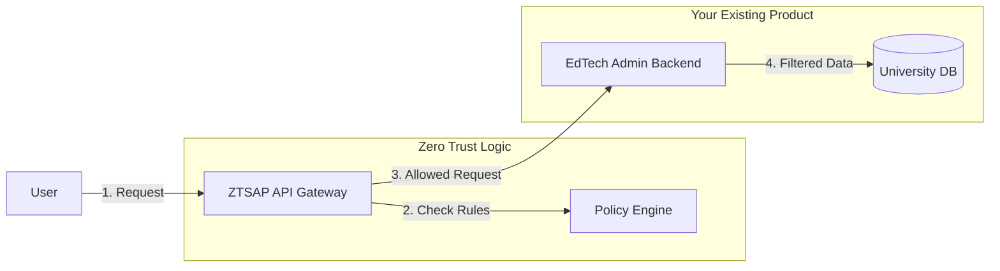

# Integration Guide: EdTech Admin Platform & Zero-Trust Architecture

This guide explains how to integrate the **Zero-Trust API Platform (ZTSAP)** with a **University EdTech Admin Platform** to enforce strict "Data Visibility Rules".

## 1. The Integration Architecture

To secure your EdTech platform, you will place the ZTSAP components **in front** of your existing EdTech Microservices.



## 2. Implementing Data Visibility Rules

Data visibility (e.g., *"HOD sees only their department"*) is handled using **Attribute-Based Access Control (ABAC)**. This involves two steps:

1.  **The "Can I Enter?" Check (Policy Engine)**: Decides if the user can use the feature at all (e.g., "Can view Student Profiles").
2.  **The "What Can I See?" Scope (Service Layer)**: Filters the actual data based on the User's Attributes (e.g., "Department = CS").

### Step 2.1: Define User Attributes (The "Tags")
In the **Auth Service**, every user gets specific tags (Attributes) in their Token (JWT) when they log in.

| Role | Attributes in Token (Example) |
| :--- | :--- |
| **Vice Chancellor (VC)** | `{ "role": "VC", "access_level": "GLOBAL" }` |
| **Registrar** | `{ "role": "REGISTRAR", "access_level": "ADMIN" }` |
| **HOD (Computer Science)** | `{ "role": "HOD", "access_level": "DEPT", "dept_id": "CS" }` |
| **Faculty (Physics)** | `{ "role": "FACULTY", "access_level": "DEPT", "dept_id": "PHYSICS" }` |

### Step 2.2: Define Visibility Rules (Policy Engine)

You define these rules in the **Policy Engine** database.

**Rule example: "Who can View Student Data?"**

```json
// Policy ID: VIEW_STUDENT_DATA
{
  "action": "read",
  "resource": "student_records",
  "rules": [
    // Rule 1: VC and Registrar can see EVERYTHING
    {
      "match_role": ["VC", "REGISTRAR"],
      "effect": "ALLOW",
      "constraint": "NONE"
    },
    // Rule 2: HODs can only see their OWN Department
    {
      "match_role": ["HOD"],
      "effect": "ALLOW",
      "constraint": "MATCH_DEPT" 
    }
  ]
}
```

### Step 2.3: Enforcing Visibility (The EdTech Backend)

When the **EdTech Backend** receives the request from the Gateway, it looks at the **Token Attributes** and the **Policy Decision**.

*   **Scenario A: The Registrar Requests Data**
    1.  **Gateway** checks Policy. Result: `ALLOW` (Constraint: `NONE`).
    2.  **Gateway** forwards request to EdTech Backend.
    3.  **EdTech Backend** sees `constraint: NONE`.
    4.  **Query**: `SELECT * FROM students;` (Returns ALL students).

*   **Scenario B: The CS HOD Requests Data**
    1.  **Gateway** checks Policy. Result: `ALLOW` (Constraint: `MATCH_DEPT`).
    2.  **Gateway** forwards request to EdTech Backend with user's `dept_id: CS`.
    3.  **EdTech Backend** sees `constraint: MATCH_DEPT`.
    4.  **Query**: `SELECT * FROM students WHERE department = 'CS';` (Returns ONLY CS students).

## 3. Workflow for Setting New Rules

When you want to change visibility rules in your Admin Platform:

1.  **Admin** (e.g., IT Head) opens the **Policy Dashboard**.
2.  **Action**: Updates the JSON Policy for "Grade Sheets".
    *   *Change*: "Allow 'Faculty' to view grades."
3.  **System**: Saves this new rule to the **Policy Engine Database**.
4.  **Effect**: Instantly, all Faculty members can view grades, but strictly defined by the Logic (likely their own subjects).

## 4. Summary

To integrate:
1.  **Tag Users**: Ensure your Auth Service adds `department`, `role`, and `clearance_level` to the JWT.
2.  **Gate the API**: Route all traffic through the ZTSAP Gateway.
3.  **Filter in Backend**: Your EdTech services must read the `department` from the Token and append it to SQL queries (`WHERE dept = ?`).
