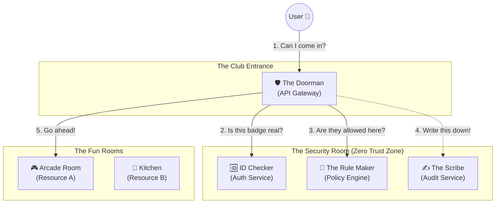
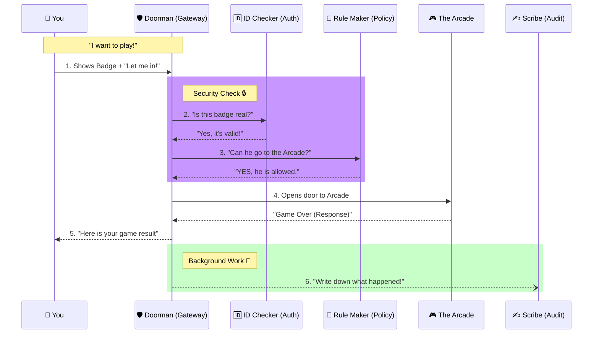

# The "Super Secure Club" (Zero-Trust API Platform) - Explained for a 5-Year-Old Techie

Imagine this software is a **Super Exclusive Club**. We want to make sure only the right people get in, and they only do what they are allowed to do. We don't trust ANYONE by default.

Here are the characters in our story:

1.  **The User (You)**: You want to get into the club to play video games or eat pizza.
2.  **The Doorman (API Gateway)**: He stands at the front door. He stops *everyone*. He is big and tough but doesn't know the rules himself; he just asks others.
3.  **The ID Checker (Auth Service)**: He sits in a booth. He checks your face and name. If you are a member, he gives you a **Special Badge** (we call this a **Token**).
4.  **The Rule Maker (Policy Engine)**: He has a big book of rules. He knows things like "Only VIPs can eat pizza" or "Kids can only play video games."
5.  **The Scribe (Audit Service)**: He stands in the corner with a notebook. He writes down **EVERYTHING**. "Kumar entered at 5 PM", "Stranger tried to sneak in and was caught."
6.  **The Rooms (Microservices)**: These are the fun places inside: The Arcade, The Kitchen, The Pool.

---

## 1. The Architecture (The Club Map)

Here is a simple map of our Club.

---

## 2. The Complete Flow (Step-by-Step Story)

This is exactly what happens, step-by-step, when you try to do something (like order a Pizza).

### Phase 1: Getting the Badge (Login)

1.  **You** go to the **ID Checker** booth. "Hello, I am Kumar, and here is my secret password."
2.  **ID Checker** looks in his list. "Aha! You are Kumar. Here is your **Special Badge (Token/JWT)**. Don't lose it! It expires in 1 hour."
3.  **You** take the badge and stick it on your shirt.

### Phase 2: Trying to Enter a Room (API Request)

4.  **You** walk up to the **Doorman** and say: "I want to go to the **Kitchen** to **Eat Pizza**." You point to your Badge.
5.  **The Doorman** (who trusts no one) grabs your badge.
    *   *Doorman thinks*: "Is this a fake badge made of cardboard?"
    *   He calls the **ID Checker**: "Hey, is this badge real?"
    *   **ID Checker** says: "Yes, I signed that badge 5 minutes ago. It's real."
6.  **The Doorman** is happy the badge is real, but he doesn't know if you are *allowed* in the Kitchen.
    *   He calls the **Rule Maker**: "Hey, Kumar wants to go to the **Kitchen** to **Eat Pizza**. Is that okay?"
7.  **The Rule Maker** opens his big book.
    *   *He checks*: "Kumar is a 'Regular Member'. Regular Members are NOT allowed in the Kitchen, only 'Chefs' are."
    *   **Rule Maker** shouts: "NO! DENIED!"
8.  **The Doorman** looks at you and crosses his arms. "Sorry, you can't go in there. Access Denied."
9.  **The Scribe** quietly writes in his notebook: *"User Kumar tried to enter Kitchen at 12:00 PM. Result: BLOCKED."*

### Phase 3: Success (Happy Path)

10. **You** try again. "Okay, can I go to the **Arcade** to **Play Games**?"
11. **The Doorman** calls the **Rule Maker** again. "Kumar -> Arcade -> Play Games?"
12. **The Rule Maker** checks the book. "Regular Members... Arcade... YES, allowed!"
13. **The Doorman** steps aside. "Right this way, sir."
14. **You** run into the **Arcade** and play games.
15. **The Doorman** yells to **The Scribe**: "Write it down! Kumar is in the Arcade!"
16. **The Scribe** writes: *"User Kumar entered Arcade at 12:05 PM. Result: ALLOWED."*

---

## 3. The Sequence Diagram (The Conversation)

Here is who talks to whom.

## Summary for the 5-Year-Old
- **We trust NOBODY.** (Zero Trust)
- **First, prove who you are.** (Authentication)
- **Then, we check if you are allowed.** (Authorization)
- **Finally, we write it all down.** (Auditing)
