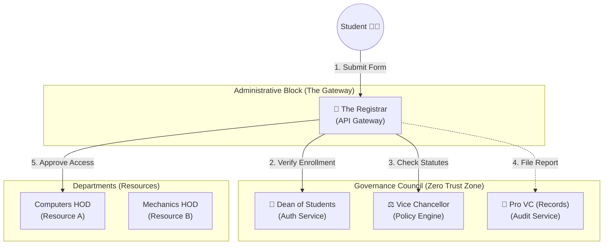
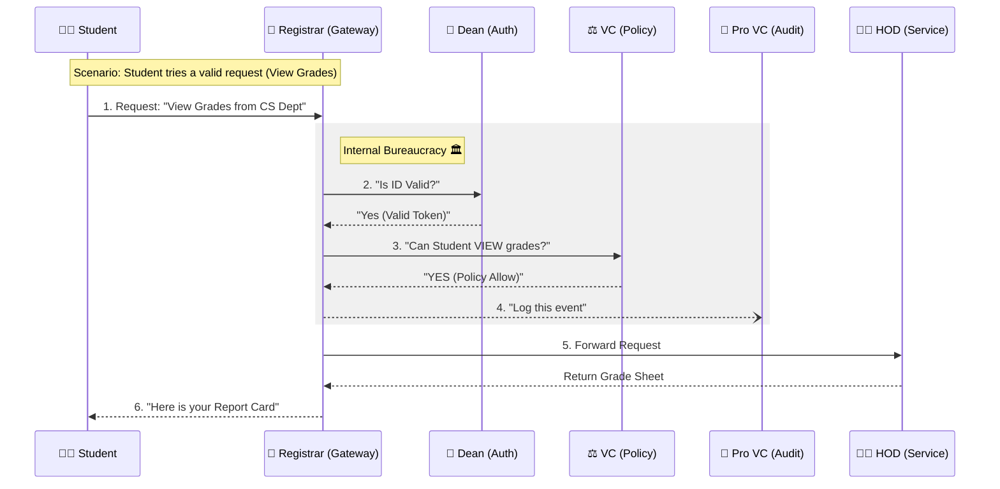

# The University Zero-Trust Model - Explained

In this analogy, the entire API Platform is a strictly managed **University**. We want to ensure that Students (Users) follow all protocols before they interact with Faculties or Heads of Departments (Microservices).

**The Cast of Characters:**

1.  **The Student (User/Client)**: Wants to access university resources (e.g., submit an assignment, check grades).
2.  **The Registrar (API Gateway)**: The central administrative office. **ALL** requests must go through the Registrar. You cannot walk directly into a Department; the Registrar controls all traffic.
3.  **The Dean of Students (Auth Service)**: Responsible for Student Records. Verifies if the Student ID card is valid and if the student is currently enrolled.
4.  **The Vice Chancellor (VC) (Policy Engine)**: The ultimate authority on rules and statutes. Decides *who* is allowed to do *what* based on University Policy (e.g., "Only Final Year students can access the Thesis Lab").
5.  **The Pro-Vice Chancellor (Pro VC) (Audit Service)**: The Chief of Records and Compliance. Documents every single administrative action for future inspection.
6.  **The HOD & Faculties (Microservices)**: The actual providers of education and resources (Business Logic).

---

## 1. The Architecture Diagram (University Org Chart)

---

## 2. The Complete Flow (The "Change Grade" Request)

Let's imagine a **Student** wants to **Change a Grade** (a sensitive action).

### Step 1: The Request (API Call)
The **Student** walks into the **Registrar's Office** with a request form:
> "I want to meet the **Computer Science HOD** to **Change my Grade**."

### Step 2: Identification (Authentication)
The **Registrar** is suspicious (Zero Trust). He calls the **Dean of Students**.
*   **Registrar**: "Dean, is this ID card valid? Is this student currently enrolled?"
*   **Dean**: Checks the database. "Yes, this is a valid student. Here is their verified stamped file (Token)."
    *   *(If invalid, the Dean says "Expelled!" and the Registrar throws the student out - 401 Unauthorized).*

### Step 3: Governance Check (Authorization)
The ID is valid, but *can* a Student change grades? The **Registrar** consults the **Vice Chancellor (VC)**.
*   **Registrar**: "VC Sir, this Student wants to **Change a Grade** with the **CS HOD**."
*   **VC**: Opens the *University Statutes (Policy Database)*.
    *   *Rule #55*: "Students can VIEW grades."
    *   *Rule #56*: "Only FACULTY can CHANGE grades."
*   **VC**: "Absolutely NOT. Request Denied. Students trigger a simplified 'View Only' policy."
    *   *(The logic prevents the student from performing an unauthorized action).*

### Step 4: The Record (Auditing)
The **Registrar** adheres to strict compliance. He informs the **Pro VC**.
*   **Registrar**: "Pro VC, please note: Student attempted to modify grades at 12:30 PM."
*   **Pro VC**: "Noted in the Permanent Ledger. We will review this for disciplinary action."

### Step 5: The Outcome (Response)
The **Registrar** returns the form to the **Student** with a big red "REJECTED" stamp.
*   **Registrar**: "403 Forbidden. You do not have permission to perform this action."

---

## 3. The Sequence Diagram (Administrative Workflow)

