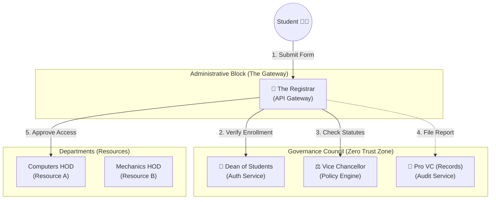

# The University Zero-Trust Model - Explained

In this analogy, the entire API Platform is a strictly managed **University**. We want to ensure that Students (Users) follow all protocols before they interact with Faculties or Heads of Departments (Microservices). **Crucially, the Staff doesn't trust each other either.**

**The Cast of Characters:**

1.  **The Student (User/Client)**: Wants to access university resources.
2.  **The Registrar (API Gateway)**: The central checkpoint. **NO ONE** moves without the Registrar checking.
3.  **The Dean of Students (Auth Service)**: Holds the "List of Verified People".
4.  **The Vice Chancellor (VC) (Policy Engine)**: Holds the "Rulebook".
5.  **The Pro-Vice Chancellor (Pro VC) (Audit Service)**: The "Permanent Record" keeper.
6.  **The HOD & Faculties (Microservices)**: The Departments (CS, Mech, Admin).

---

## 1. The Architecture Diagram (University Org Chart)

---

## 2. The Complete Flow (The "Student" Perspective)

**Scenario**: Student wants to **Change a Grade**.

1.  **Student (User)**: asks **Registrar** to see **CS HOD** to change a grade.
2.  **Registrar**: asks **Dean** "Is this ID real?" -> **Dean**: "Yes."
3.  **Registrar**: asks **VC** "Can Student change grade?" -> **VC**: "NO. Rule #56 says only Faculty can."
4.  **Registrar**: tells **Pro VC** "Write down that Student tried to change grade."
5.  **Registrar**: tells **Student** "REJECTED (403 Forbidden)."

---

## 3. Internal Perspectives: The "Zero Trust" Reality

In a Zero-Trust University, **even the powerful staff are restricted**. Here is why:

### Perspective 1: The Computer Science HOD (Service A)
*Imagine you are the Head of the Computer Science Department.*

*   **Your Goal**: You made a mistake and want to **DELETE** a record from the **Pro VC's (Audit)** permanent file so no one sees it.
*   **The Action**: You try to walk into the Pro VC's office to shred a document.
*   **The Restriction**:
    *   The **Registrar** stops you at the door.
    *   **Registrar**: "Where are you going, HOD?"
    *   **You**: "To the Audit Room."
    *   **Registrar**: Checks with the **VC** (Policy). "Does HOD CS have 'DELETE' access to Audit Records?"
    *   **VC**: "Absolutely NOT. Rule #99: Audit Logs are Immutable (Permanent)."
    *   **The Result**: **ACCESS DENIED**. Even though you are a powerful HOD, you cannot touch the Audit logs. You are restricted to your own department.

### Perspective 2: The Vice Chancellor (Policy Engine)
*Imagine you are the VC who makes the rules.*

*   **Your Goal**: You want to **Change a Grade** for your nephew who is a student in the Mechanical Dept.
*   **The Action**: You try to walk into the **Mechanics HOD's** office to use their computer.
*   **The Restriction**:
    *   The **Registrar** stops you.
    *   **Registrar**: "VC, you are trying to access the Mechanics Grade Database. Let's check the rules."
    *   **Registrar**: Checks the Rulebook (which the VC wrote!). "Rule #10: Only the 'Course Instructor' can change grades. YOU are the 'Policy Administrator', not an 'Instructor'."
    *   **The Result**: **ACCESS DENIED**. Being the Rule Maker doesn't give you the key to every room. You have 'Administrative' power, not 'Operational' power. This is called **Separation of Duties**.

### Perspective 3: The Mechanical HOD (Service B)
*Imagine you are the Head of the Mechanical Department.*

*   **Your Goal**: You want to borrow a Super Computer from the **CS Department**.
*   **The Action**: You send your staff to the CS Lab.
*   **The Restriction**:
    *   The **Registrar** intervenes. (Service-to-Service Communication).
    *   **Registrar**: Checks with **VC** (Policy). "Can the Mechanical Dept access the CS Lab's Super Computer?"
    *   **VC**: Checks the 'Inter-Departmental Treaty'. "No, these resources are rigidly separated to prevent budget overlap."
    *   **The Result**: **ACCESS DENIED**. Just because you are both Departments (Microservices) doesn't mean you trust each other. You are isolated.

---

## 4. Summary of Restrictions

| Role | Power | Restriction (What they CANNOT do) |
| :--- | :--- | :--- |
| **Registrar (Gateway)** | Controls traffic | Cannot open the mail (Encryption) or deciding rules (Policy). Just a guard. |
| **Dean (Auth)** | Verifies Identities | Cannot say *what* you can do, only *who* you are. Cannot change grades. |
| **VC (Policy)** | Makes Rules | Cannot break their own rules. Cannot touch actual Student Data in Departments. |
| **Pro VC (Audit)** | Records History | Cannot change history ("Read Only"). Cannot interfere with live classes. |
| **HOD (Service)** | Runs Department | Cannot touch other Departments. Cannot delete Audit Logs. |

**This is Zero Trust**: Every single request, whether from a Student or top-level VC, goes through the **Registrar**, is checked by the **Dean**, and validated by the **VC's Rulebook**. No exceptions.
